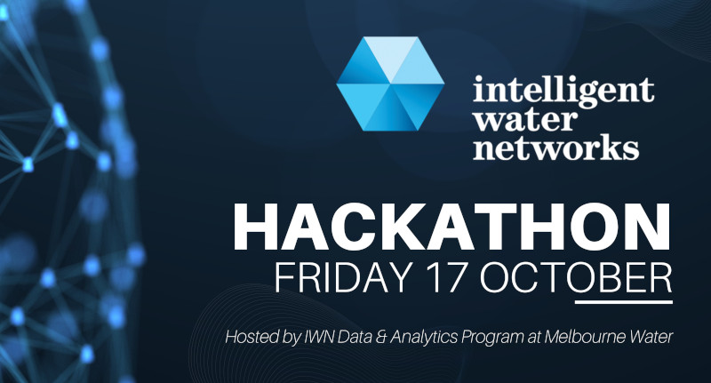

> Modify consumer behaviour towards saving water through gamification

The main objective of this hackathon is to develop a practical solution that incentivizes consumer behaviour change to promote water conservation. By leveraging digital metering data, participants are encouraged to explore how turning conservation into a rewarding and engaging game can foster sustained changes in water usage habits. 

The raw data consists of anonymised data from the European [SmartH2O project](https://zenodo.org/records/556725). The files in this repository provided a cleaned version fo  this data, ready for analysis.

Further detail is available in the [Challenge Document](www/iwn-hackathon-2025-challenge.pdf)

You can explore the data in an [interactive application](https://prevos.shinyapps.io/iwn-hackathon-2025/).

## Files
- `clean_data`: Cleaned data files (zipped file only on GitHub due to size limitations)
- `raw_data`: Original data files from SmartH2O project
- `LICENSE`: GPL 3 Free Software license
- `README.md`: This file
- `etl.R`: R Script to transform the raw data
- `shiny-application.R`: Interactive application to explore the data

### Raw Data
The SmartH2O project provides anonymised digital metering datasets from the towns of Terre Di Pedemonte and Valencia in Switserland and Spain. 

Each dataset is stored in its named folder and contains: `anonymizer.zip`. Once decompressed, the archived files are `smarth2o_anonymized_households.csv` and `smarth2o_anonymized_consumptions.csv`

### Extract, Transfer & Load process
The raw data is extracted and transferred with the `etl.R` script to create [tidy data](https://r4ds.had.co.nz/tidy-data.html). The data is stored in three files:

- `appliances.csv`: Count of water appliances for households
- `houshold_meta_data.csv`: Meta data related to households
- `meter_reads.csv`: Meter reads

Due to GitHub size limitations, these files are provided in a ZIP archive: `clean_data.zip`.

### `meter_reads.csv`
- `smart_meter_id`: The smart meter's unique ID. Starts with either T (Terre Di Pedemonte) or V (Valencia), followed by a three-digit number.
- `timestamp`: Timestamp in local time.
- `meter_reading`: Cumulative meter read in litres.
- `town`: name of the town (Terre Di Pedemonte or Valencia).

Note that this data shows regular anomalies, such as negative flows.

Metadata is only available for a small subset of the participating digital meters.

### `household_meta_data.csv`
- `smart_meter_id`: The smart meter's unique ID. Starts with either T (Terre Di Pedemonte) or V (Valencia), followed by a three-digit number.
- `household_size`: The size of the Household (in square meters)
- `household_garden_area` The size of the garden (in square meters)
- `household_pool_volume` The volume of the pool (in cubic meters)
- `household_pool` The presence of the pool (boolean)
- `household_garden` The presence of the garden (boolean)
- `residency_type` The type of residency (Flat, House, Single Family, ...)
- `number_bathrooms` The number of bathrooms
- `environmental_attitude` The environmental attitude sensitivity of the user 
- `irrigation_system` The presence of an irrigation system (boolean)
- `house_plants` The presence of house plants (boolean)
- `balcony_plants` The presence of balcony plants (boolean)
- `building_size` The size of the building (in square meters)
- `appliance` The name of a complex device (washing machine, dishwasher, ...)
- `efficiency` The efficiency of the complex device ( A, A+, A++, ...)
- `ecomode` The presence of the Eco-Mode feature in the complex device (boolean)
- `timer` The presence of the timer in the complex device (boolean)

### `appliances.csv`
- `smart_meter_id`: The smart meter's unique ID.
- `appliance`: Type of appliance.
- `number`: Number of appliances in the household.

